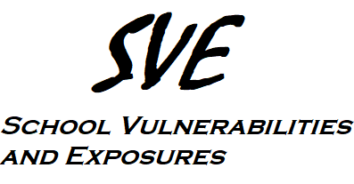

# school-hacks 
## Co to jest?
Hacki i strategie oszukiwania do najpopularniejszych platform edukacyjnych
## Dlaczego?
Może być wiele powodów, na przykład:
- Chcesz zhackować quiz dla zabawy
- Chcesz podnieść sobie oceny bez wysiłku
- Nienawidzisz systemu edukacji w swoim kraju
- Jesteś nauczycielem i chcesz sprawdzić, czy Twój sprawdzian może być zhackowany.
## Jak z tego korzystać?
Po prostu otwórz folder z nazwą danej platformy, aby dowiedzieć się, jak ją zhackować.
## Jak pomóc?
Pull Requesty zawierające więcej strategii i/lub platform mile widziane!
Możesz również otworzyć zgłoszenie typu Feature Request.
## Wyłączenie odpowiedzialności
### Wyłącznie do celów edukacyjnych! Nie ponoszę odpowiedzialności za szkody wyrządzone przez opisywane tu strategie, skrypty i narzędzia!
## Jeśli jesteś właścicielem platformy wymienionej w projekcie:
1. Nie dzwoń na policję. Nic Ci to nie da. Jesteśmy legionem.
2. Napraw opisane tutaj błędy tak szybko jak się da (jeśli chcesz poznać więcej szczegółów, utwórz zgłoszenie).
3. Utwórz zgłoszenie, żebym ponownie sprawdził Twoją platformę.