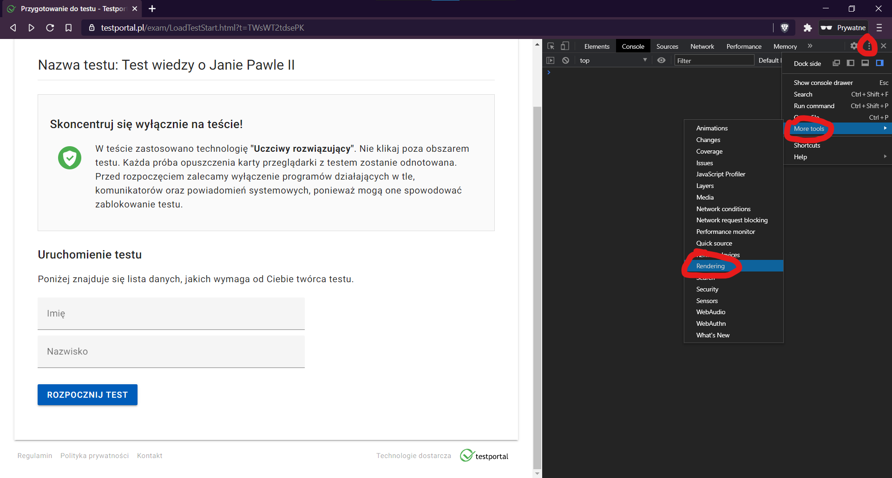
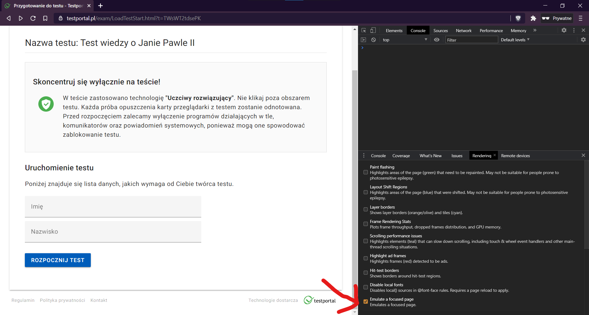
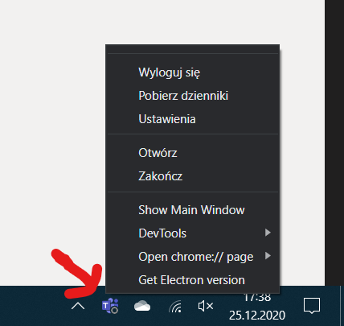
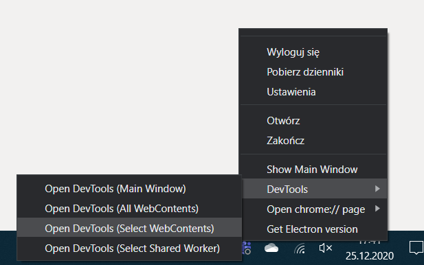
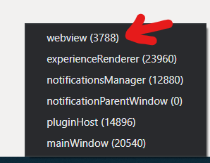

# *Testportal* cheating strategies
| Type of cheat             | Possible?     |
| -----------------         |:-------------:|
| Stealing correct answers  | NO            |
| Stealing others' answers  | NO            |
| Bypassing anti-cheat      | YES           |
| Extending time to solve   | SOMETIMES     |
| Spamming and flooding     | SOMETIMES     |
| Other exploits            | NONE          |

## Stealing correct answers
Not posibble. All answers are checked server-side.

## Stealing others' answers
Not posibble. Session management has no known vulnerabilities.

## Bypassing anti-cheat
You can watch a video version of this tutorial [here](SecurityBypassEN.mp4).
- Using Chrome DevTools (easy, but only if test is in browser)
    - Press F12 **before you start the test**.
    - Select more tools -> rendering.
    
    - Check "emulate a focused page".
    
    - **Remember to not close DevTools during test!**
    You can minimize or resize them.
    - You are ready to start! Anti-cheat protection will not see You leaving test window.

- Using Electron DevTools (easy, works if test is embedded into Microsoft Teams)
    - Open the test tab (link sent by Your teacher) but **don't start the test yet**.
    - Click Microsoft Teams icon on Your notification bar **7 times with right button, then once with left button**. This will show secret developer options.
    
    - Click on DevTools, Select WebContents.
    
    - From menu that will appear, select Webview.
    
    - You will see DevTools. Press CTRL+SHIFT+P, type *focused*, then press enter.
    
    - **Remember to not close DevTools during test!**
    You can minimize or resize them.
    - You are ready to start! Anti-cheat protection will not see You leaving test window.

- Using VM (medium, strong computer recommended)
    - VirtualBox: https://www.tutorialspoint.com/virtualization2.0/virtualization2.0_virtualbox.htm
    - HyperV: https://docs.microsoft.com/en-us/virtualization/hyper-v-on-windows/quick-start/quick-create-virtual-machine
    - Windows Subsystem for Linux 2.0 (my favourite):
    https://medium.com/@japheth.yates/the-complete-wsl2-gui-setup-2582828f4577

## Extending time to solve
It is not possible to extend time to solve whole test. However, it is possible to stop the timer for single questions. Just clear all JavaScript timeouts:
```js
var highestTimeoutId = setTimeout(";");
for (var i = 0 ; i < highestTimeoutId ; i++) {
    clearTimeout(i); 
}
```
Make sure that You have bypassed anti-cheat protection first! Your teacher **will not** see that You have stopped the timer.

## Spamming and flooding
If the test is not protected by Microsoft Teams authentication, You can solve it as many times as You want with fake data. In best scenario, You can speedrun whole test with fake data, take screenshot of correct answers (only if summary is enabled by teacher) and solve Your test with Your data with 100% of correct answers.

## Other exploits
No other exploits avaiable now.