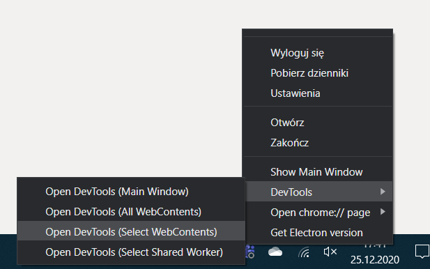
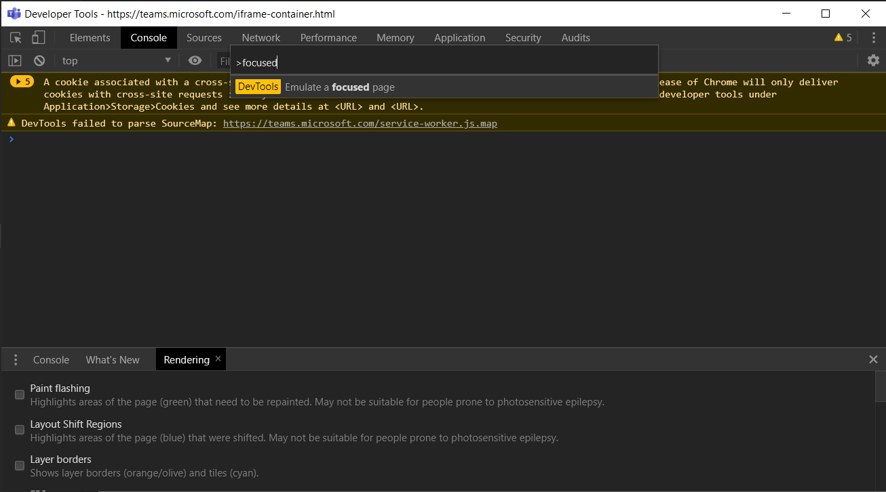

# *Testportal* - strategie oszukiwania
| Typ oszustwa              | Wykonalne?    |
| -----------------         |:-------------:|
| Wyciek klucza odpowiedzi  | NIE           |
| Wyciek odpowiedzi innych  | NIE           |
| Obejście zabezpieczeń     | TAK           |
| Zwiększenie limitu czasu  | CZASAMI       |
| Spamowanie/floodowanie    | CZASAMI       |
| Inne                      | BRAK          |

## Wyciek klucza odpowiedzi
Niewykonalne. Odpowiedzi sprawdzane po stronie serwera.

## Wyciek odpowiedzi innych
Niewykonalne. Brak podatności w mechanizmach sprawdzania sesji.

## Obejście zabezpieczeń
Wideo do tego poradnika jest dostępne [tutaj](TestportalSecurityBypassPL.mp4).
- Użycie narzędzi deweloperskich Chrome (łatwa, ale działa tylko dla testów w przeglądarce)
    - Naciśnij F12 **zanim rozpoczniesz test**.
    - Wybierz więcej narzędzi -> renderowanie.
    
    - Zaznacz "emulacja aktywnej karty".
    
    - **Nie zamykaj narzędzi deweloperskich!**
    Możesz je zminimalizować lub zmniejszyć.
    - Jesteś gotowy! Technologia Uczciwy Rozwiązujący nie wykryje, gdy opuścisz kartę z testem.

- Użycie narzędzi deweloperskich Electron (łatwe, działa dla testów w Teams)
    - Otwórz kartę z testem (link od nauczyciela) **ale nie rozpoczynaj go jeszcze**.
    - Kliknij ikonkę Teamsów na pasku powiadomień **7 razy prawym przyciskiem, a następnie raz lewym**. To otworzy tajne narzędzia deweloperskie.
    
    - Wybierz "DevTools, Select WebContents".
    
    - Z kolejnego menu wybierz Webview.
    
    - Otworzą się narzędzia deweloperskie. Wciśnij kombinację CTRL+SHIFT+P, wpisz *focused*, i naciśnij klawisz enter.
    
    - **Nie zamykaj narzędzi deweloperskich!**
    Możesz je zminimalizować lub zmniejszyć.
    - Jesteś gotowy! Technologia Uczciwy Rozwiązujący nie wykryje, gdy opuścisz kartę z testem.

- Użycie maszyny wirtualnej (zalecane dla mocnych komputerów)
    - VirtualBox: https://www.tutorialspoint.com/virtualization2.0/virtualization2.0_virtualbox.htm
    - HyperV: https://docs.microsoft.com/en-us/virtualization/hyper-v-on-windows/quick-start/quick-create-virtual-machine
    - Windows Subsystem for Linux 2.0 (moja ulubiona):
    https://medium.com/@japheth.yates/the-complete-wsl2-gui-setup-2582828f4577

## Zwiększenie limitu czasu
Limit czasu można zwiększyć tylko w przypadku, gdy aktywne jest ograniczanie czasowe poszczególnych pytań (nie całego testu), wystarczy usunąć wszystkie timery JavaScript - wklej w konsoli (F12):
```js
var highestTimeoutId = setTimeout(";");
for (var i = 0 ; i < highestTimeoutId ; i++) {
    clearTimeout(i); 
}
```
Upewnij się najpierw, że obszedłeś Technologię Ucziwy rozwiązujący!

## Spamowanie/floodowanie
Tylko, gdy brak uwierzytelniania przez Teams. Przydatne, gdy nauczyciel nie wyłączył opcji wyświetlania poprawnych odpowiedzi po teście. Wejdź z fałszywymi danymi i przeklikaj.

## Inne
Brak danych.